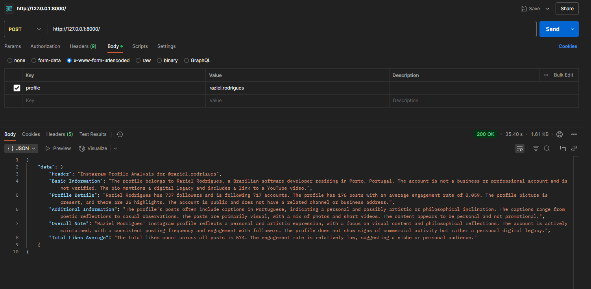

# AI BRIGHT DATA CHALLENGE

Scrape. Analyze. Optimize. Let AI decode Instagram profiles for you.

# Getting started
- Configure the .env file
    - create your bright data free acount and get your api key: https://brightdata.com
    - create your mistral free acount and get your api key: https://mistral.ai
- Start the PHP server with inside the api dir with: php -S 127.0.0.1:8000 .\index.php
- Make the request: curl.exe -X POST "http://127.0.0.1:8000/" -H "Content-Type: application/x-www-form-urlencoded" -d "profile=instagram.username"
- Get the infomation of the profile

# Example Response

# System Design

# Full Article

Please react to my article and share it to help me win the hackaton. Thank you so much :)

- https://dev.to/razielrodrigues/instaanalyzer-an-ai-instagram-analyst-powered-by-php-neuron-ai-and-bright-data-1041
