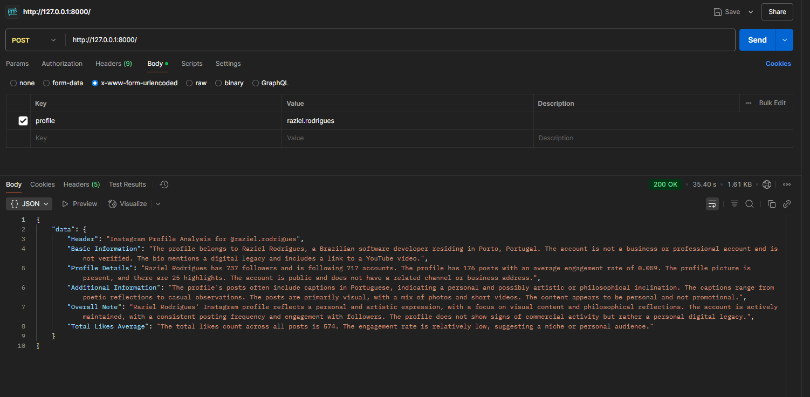
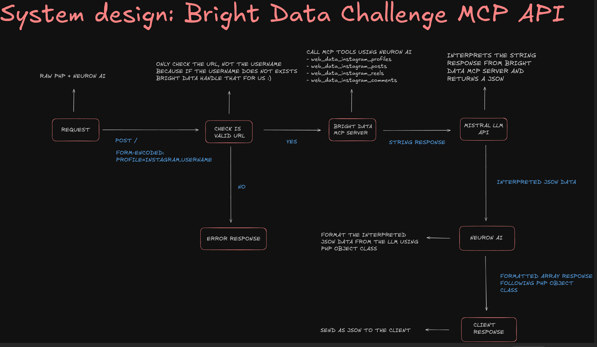
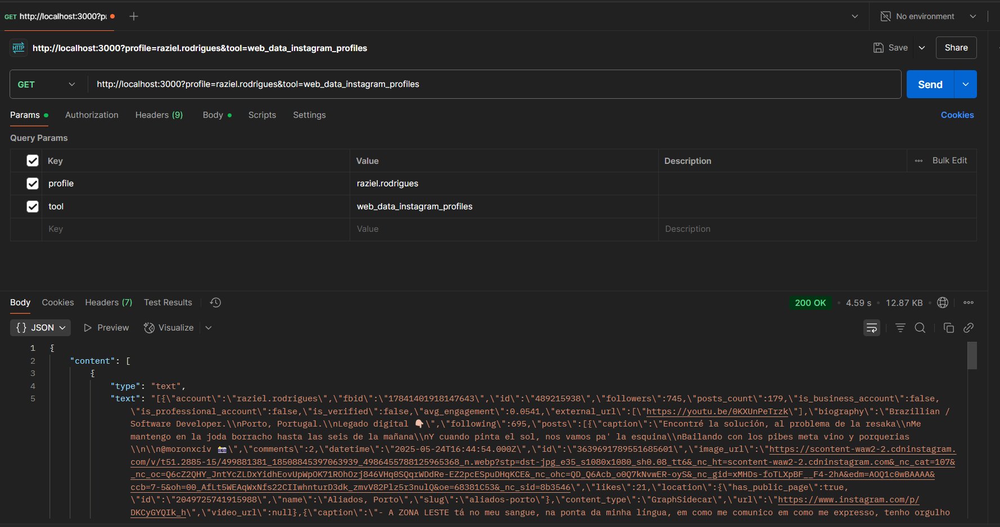
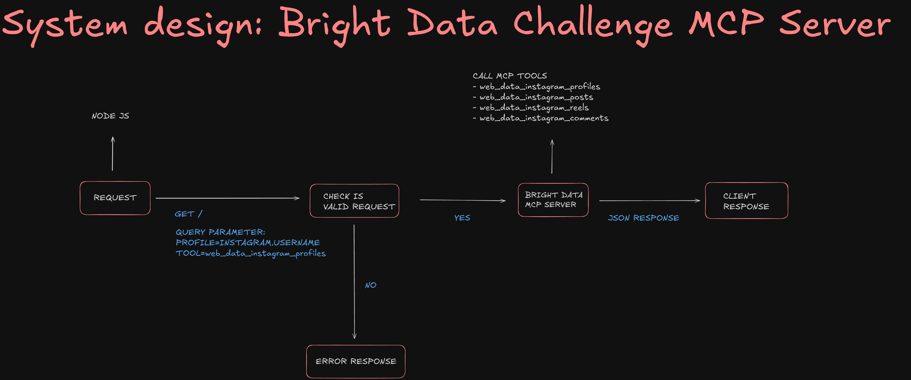

# AI BRIGHT DATA CHALLENGE API

> Scrape. Analyze. Optimize. Let AI decode Instagram profiles for you powered by Bright Data

# Getting started
- Configure the .envs file
    - create your bright data free acount and get your api key: https://brightdata.com
    - create your mistral free acount and get your api key: https://mistral.ai
    - create your smithery free acount and get your profile: https://smithery.ai
- PHP API:
    - run composer install inside app/api folder
    - Start the PHP server inside the src dir with: php -S 127.0.0.1:8000 .\index.php
    - Make the request: curl.exe -X POST "http://127.0.0.1:8000/" -H "Content-Type: application/x-www-form-urlencoded" -d "profile=instagram.username"
    - Get the infomation of the profile destiled by the LLM
- MCP SERVER:
    - run npm install inside mcp folder
    - Start the Node JS server inside the mcp/api dir with: npm run start
    - Make the request: curl.exe --location --request GET 'http://localhost:3000?profile=raziel.rodrigues&tool=web_data_instagram_profiles'
    - Get the infomation of the profile directly from the MCP tool of Bright Data

# PHP API

---

# NODE JS MCP SERVER

---

---

# Full Article

Please react to my article and share it to help me win the hackaton. Thank you so much :)

- https://dev.to/razielrodrigues/instaanalyzer-an-ai-instagram-analyst-powered-by-php-neuron-ai-and-bright-data-1041
